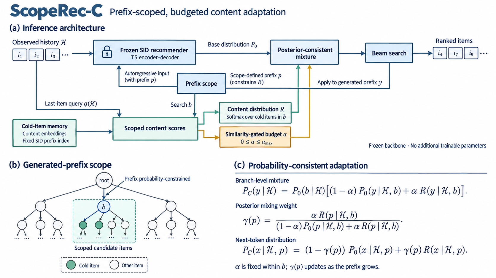

# ScopeRec

**Confidence-budgeted adaptation for cold-start generative recommendation.**

ScopeRec-C keeps a semantic-ID recommender frozen and makes new items reachable
through a content-conditioned suffix distribution. A generated-prefix gate and
an explicit probability budget control how much the existing ranking changes.



[View the full-resolution architecture](docs/assets/architecture.png) |
[Architecture and implementation details](docs/ARCHITECTURE.md)

## Highlights

- **No additional trainable weights:** adapt through content and probability
  allocation, with fixed backbone and existing semantic IDs.
- **Controlled output scope:** mix only after the model actually generates a
  selected prefix; no correct-target routing or oracle input in recommendation.
- **Reversible and reproducible:** version-checked artifacts, explicit edit
  disable, executed GenRecEdit function parity, and audited saved predictions.
- **Measured tradeoffs:** cold-item gains, warm-item costs, random seeds and
  confidence intervals are reported together.

This is an offline research/engineering project, not a production service or a
claim of zero forgetting. Content vectors still require memory and query-time work.

## Final Benchmark

Amazon Reviews 2023 Software, released-code-compatible GenRecEdit protocol,
9,386 test requests including 2,226 cold targets. Three training seeds share
the same features, SID map and evaluation requests.

| Method | Exact Cold Recall@20 | Warm NDCG@20 | Overall NDCG@20 |
| --- | ---: | ---: | ---: |
| TIGER | 0.045% | 0.05496 | 0.04197 |
| GenRecEdit, lambda 3000 | 0.150% | 0.05147 | 0.03938 |
| GenRecEdit, lambda 1000 | 0.329% | 0.04957 | 0.03806 |
| **ScopeRec-C** | **1.932%** | **0.05362** | **0.04222** |
| Uniform suffix control | 1.797% | 0.05376 | 0.04221 |


ScopeRec-C gains **1.887 percentage points of exact cold Recall@20** over TIGER
while retaining **97.56% of warm NDCG@20**. The small overall gain has a paired
interval including zero; the uniform control is close. These are matched local
results, **not superiority over the paper**. Published GenRecEdit numerical gains
were not reproduced, and released three-token prefix metrics are reported
separately from exact four-token item matching.

See [final results and uncertainty](docs/RESULTS.md). A separate, locked 2020
temporal confirmation supports the same coverage/retention analysis; its numbers
are not pooled with this benchmark. Only final comparisons are public, not grids
or intermediate runs.

## How It Works

1. Encode item text and assign fixed semantic IDs; train the base T5 once.
2. Index the active cold items by SID prefix and retain their content vectors.
3. Build a query from the most recent historical item; compute cold-item similarity.
4. After the generated prefix selects a branch, combine its original suffix
   distribution with a confidence-budgeted content distribution.
5. Continue natural Beam Search and resolve full item codes; edits can be disabled.

The current default is **ScopeRec-C**, distinct from the original learned
low-rank patch. The base distribution and its prefix probabilities stay fixed;
the mass budget bounds old-path probability change, not Recall/NDCG degradation.

[Technical architecture](docs/ARCHITECTURE.md) ·
[中文架构绘图说明](docs/ARCHITECTURE_DIAGRAM.zh-CN.md)

## Quick Start

Install a suitable [PyTorch](https://pytorch.org/get-started/locally/) build, then:

```bash
python -m pip install -e '.[ml,dev]'
python -m pytest -q
python -m scoperec results verify
python -m scoperec results figures
```

Tests and figure rendering work without GPUs, datasets or checkpoints. The
included final JSON preserves unrounded measurements and individual seeds.

To reproduce the main experiment on one GPU:

```bash
export SCOPE_PYTHON="$(command -v python)"
export SCOPE_DEVICE=cuda:0
bash scripts/reproduce_official.sh all
```

After the model/data artifacts exist:

```bash
python -m scoperec recommend --device cuda:0 --request 0 --top-k 10
python -m scoperec recommend --method tiger --device cuda:0 --request 0
python -m scoperec recommend --disable-edit --device cuda:0 --request 0
```

The demo uses a fixed benchmark catalog, not live products. Released-protocol
invalid paths are flagged rather than removed to inflate metrics. Weights and
datasets are not bundled. Detailed setup, stages and temporal comparison are in
[REPRODUCE.md](docs/REPRODUCE.md).

## Project Map

| Area | Entry |
| --- | --- |
| Current model and diagram specification | [Architecture](docs/ARCHITECTURE.md) |
| Completed comparisons and measured data | [Final results](docs/RESULTS.md) |
| CLI, workflow and code ownership | [Reproduce](docs/REPRODUCE.md) |
| Dataset and metric definitions | [Data contract](docs/DATA.md) |
| GenRecEdit reproduction scope | [References](docs/REFERENCES.md) |
| Source-only release and license checklist | [Publishing](docs/PUBLISHING.md) |

The public tree contains source, tests, configs, CI, the architecture illustration
and two final comparison charts in PNG and SVG. Experiment logs, validation grids,
datasets, weights and upstream source remain local and are excluded from the
staged GitHub snapshot.

## License

Project code is licensed under [Apache-2.0](LICENSE), as selected in
[unihsy/ScopeRec](https://github.com/unihsy/ScopeRec). Data, model and dependency
licenses remain separate from the project code.