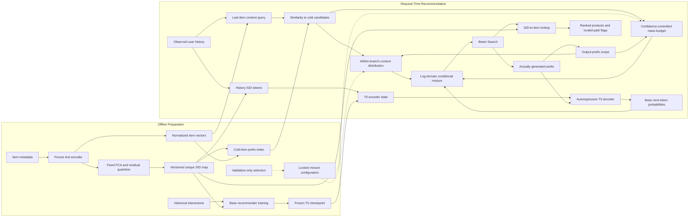

# ScopeRec-C Architecture

ScopeRec-C adapts a frozen semantic-ID recommender to cold items by mixing a
content-conditioned distribution into selected output subtrees. It does not
update the backbone, train a new routing network, or force the correct prefix.

For a diagram-ready Chinese specification, use
[ARCHITECTURE_DIAGRAM.zh-CN.md](ARCHITECTURE_DIAGRAM.zh-CN.md).

## Inference Overview

[Full-resolution figure](assets/architecture.png).

Panel (a) shows request-time inference; (b) illustrates the generated-prefix
scope; (c) gives the complete-path mixture and its token-level posterior.
For a fixed history and branch, the budget is fixed while the posterior weight
changes as the prefix grows. Branch-external probability invariance does not
imply unchanged rankings. The tree is schematic: released-benchmark search
remains unmasked and invalid item codes are still flagged, not silently removed.

## End-to-End Flow

The released benchmark uses full-vocabulary probabilities. The separate temporal
experiment masks illegal successors before normalization. These are distinct
evaluation protocols, not interchangeable settings on a single result table.

## Offline Artifacts

| Artifact | Released Benchmark | Temporal Confirmation |
| --- | --- | --- |
| Text encoder | Sentence-T5-base, 768 dimensions | MiniLM-L6-v2, 384 dimensions |
| Quantizer | White PCA to 128; three 256-entry Faiss codebooks | PCA to 128; three 64-entry codebooks |
| SID | Three semantic tokens plus collision token | Three semantic tokens plus collision token |
| Base model | Six encoder and decoder T5 layers | Six encoder and decoder T5 layers |
| Output distribution | Full vocabulary, including invalid paths and EOS | Legal catalog successors |
| Main public operating point | Depth 1; maximum budget 0.05 | Balanced: depth 1; maximum budget 0.10 |

Backbone weights, item vectors, codebooks and existing item codes are fixed during
adaptation. The released benchmark fits PCA on its full published catalog; this
is a benchmark-reproduction choice, not a claim of causal catalog visibility.
The temporal quantizer fits only pre-base items. See [DATA.md](DATA.md).

New-item preparation adds its vectors and fixed codes to the candidate-prefix
index. The current implementation scans the active cold candidates at request
time; it is not a separately learned retriever or an approximate-neighbor service.
In the released task, the cold candidate identity set comes from the held-out
split. No target identity from an individual request enters the routing computation.

## Content and Confidence

For observed history $H$, use the normalized vector of its most recent item as
query $q(H)$. Compute cosine similarities $s_i=q(H)^T e_i$ to cold candidates.
Within active branch $b$, define:

$$
R(i\mid H,b)=\frac{\exp(s_i/T)}{\sum_{j\in I_{\mathrm{cold}}(b)}\exp(s_j/T)}.
$$

`R` is zero for other output paths. If a branch contains no cold candidates,
the model uses the base distribution unchanged. Its adaptation budget is:

$$
a(H,b)=\alpha_{\max}\,\sigma\!\left(
\frac{\max_{i\in I_{\mathrm{cold}}(b)}s_i-c}{w}\right).
$$

The gate depends on history and branch content, not future clicks or the desired
target. Before `d` tokens have actually been generated, no subtree mixing occurs.

## Mass-Preserving Mixture

For complete path $y$ inside branch $b$:

$$
P_C(y\mid H)=P_0(b\mid H)
\left[(1-a(H,b))P_0(y\mid H,b)+a(H,b)R(y\mid H,b)\right].
$$

In the released protocol, paths contain four item tokens and a fifth output token;
the content component emits the item's EOS. The mixture is normalized over the
full path space, so it can shift mass from invalid paths to actual products.
It does not promise conservation of the valid catalog's total probability mass.

The token-level content posterior at descendant prefix $p$ is:

$$
\gamma(p)=\frac{a(H,b)R(p\mid H,b)}{
(1-a(H,b))P_0(p\mid H,b)+a(H,b)R(p\mid H,b)}.
$$

The next-token distribution combines base and content successors using `gamma`.
This is **not** a constant blend applied independently at every token. The released
implementation uses `logaddexp` to preserve tiny base-path probabilities.

## Guarantees and Limits

- Prefix probability and total active-branch mass are unchanged under fixed inputs.
- Complete paths outside active branches are unchanged.
- Old-item path probability inside a branch is multiplied by `1-a`, giving the
  lower bound `1-alpha_max`. This does not bound ranking-metric degradation.
- A prefix pruned before the gate activates cannot be recovered by a suffix mixture.
- A batch can activate nearly every coarse prefix; in that case the explicit mass
  budget, not a large untouched region, is the practical protection.

No extra model weights are trained by ScopeRec-C. Content vectors still cost
memory: about 51.5 MiB in the released Software run and 130.7 MiB in the temporal
run. Query-time work is measured, not assumed free.

## Engineering Boundaries

Content artifacts and serving checks bind the base, SID map, embedding table,
catalog and selected configuration. Text encoding uses highest FP32 matmul
precision so training's TF32 setting cannot silently alter codes. Existing SID
artifacts must not be regenerated under an old checkpoint.

The public demo exposes explicit method selection and `--disable-edit`. Invalid
released-benchmark paths are flagged, not filtered or replaced. The temporal demo
uses its legal tree. Neither is an online storefront or an HTTP serving platform.

GenRecEdit is a comparison branch with its own FFN optimizer and One-One hooks.
Pseudo-request construction and FFN weight updates are not part of ScopeRec-C's
request-time graph. Original low-rank ScopeRec code remains for controlled
experiments; it is not the current default architecture.