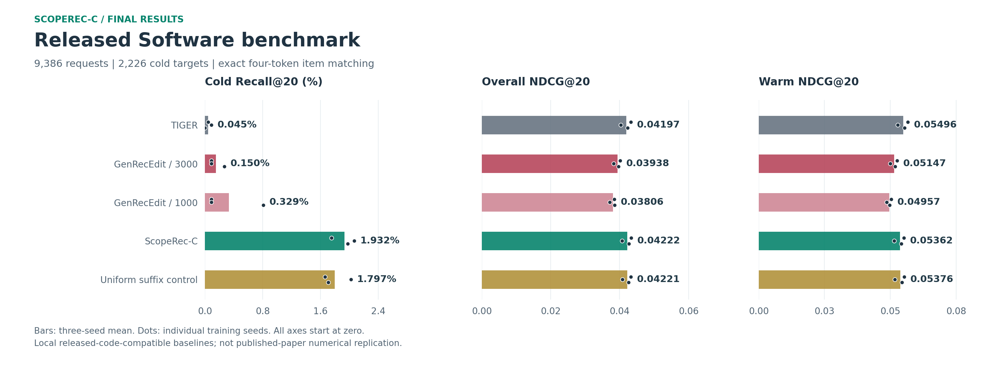
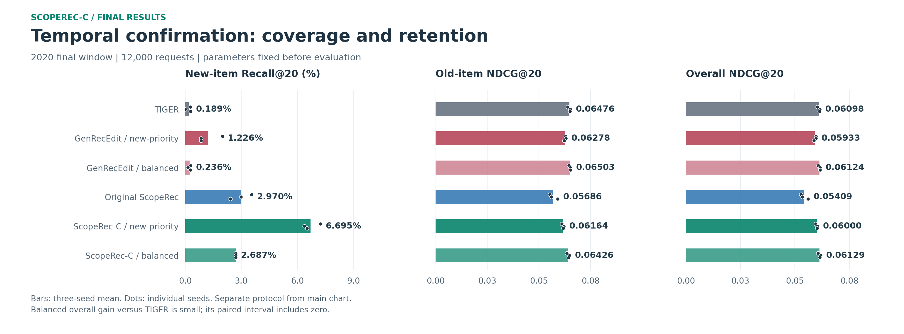

# Final Results

This page contains completed comparisons only. Validation grids, training logs,
intermediate checkpoints and request-level traces are not part of the public
release. Exact, unrounded metrics and individual seed measurements are retained
in [final_metrics.json](results/final_metrics.json).

## Released Software Benchmark

Amazon Reviews 2023 Software, official 5-core timestamp-with-history files,
three seeds (2024/2025/2026), 9,386 test requests, 2,226 cold targets, and 17,591
catalog items. Every method shares its backbone per seed, SID map, history inputs
and full-vocabulary Beam Search. The released task uses held-out users and cold
target identities in constructing its benchmark; it is not an online deployment.

The main table uses **four-token exact item matching**, not semantic-prefix hits.
Recall is a percentage; NDCG is on its original 0-1 scale. Values are mean
plus/minus sample standard deviation across the three fixed training seeds.

| Method | Cold Recall@20 | Warm NDCG@20 | Overall NDCG@20 |
| --- | ---: | ---: | ---: |
| TIGER | 0.045% +/- 0.045% | 0.05496 | 0.04197 |
| GenRecEdit, lambda 3000 | 0.150% +/- 0.104% | 0.05147 | 0.03938 |
| GenRecEdit, lambda 1000 | 0.329% +/- 0.415% | 0.04957 | 0.03806 |
| **ScopeRec-C** | **1.932% +/- 0.162%** | **0.05362** | **0.04222** |
| Uniform suffix control | 1.797% +/- 0.196% | 0.05376 | 0.04221 |



ScopeRec-C increases exact cold Recall@20 by **1.887 percentage points** versus
TIGER while retaining **97.56% of its warm NDCG@20**. The absolute recall is still
low; ratios against a near-zero baseline are not used as headline claims.
The small overall gain is not statistically established, and the uniform control
is close. The result supports controlled probability allocation, not a claim of
universal superiority or a proven large content-ranking advantage.

Selected settings: depth 1, maximum probability budget 0.05, content temperature
0.05, confidence threshold 0.5, sigmoid width 0.05. The selection used overall
validation prefix NDCG@10; no final test outcome selected this operating point.

## Metric and Reproduction Boundaries

The official released evaluator matches the **first three** semantic tokens.
The local prefix-compatible results are:

| Method | Prefix Overall NDCG@10 | Prefix Cold Recall@20 |
| --- | ---: | ---: |
| TIGER | 0.03349 | 0.299% |
| GenRecEdit, lambda 3000 | 0.03173 | 0.704% |
| GenRecEdit, lambda 1000 | 0.03085 | 0.973% |
| ScopeRec-C | 0.03365 | 2.141% |
| Uniform suffix control | 0.03366 | 2.007% |

The paper reports Software Overall NDCG@10 of 0.0353 for TIGER and 0.0370 for
GenRecEdit. Its GenRecEdit gains have **not** been numerically reproduced here.
The paper describes RQ-VAE without an extra collision token and classifier-based
layer selection, whereas executable defaults use Faiss, a fourth token and
fixed layers. Our measured cold fraction is 23.72%, versus the paper's 24.3%.
See [DATA.md](DATA.md) and [REFERENCES.md](REFERENCES.md) for the full boundaries.

Unmasked search can emit invalid item codes. These paths were retained, never
removed to improve metrics. Mean invalid-full-SID fractions among top 50 were
11.09% (TIGER), 14.57% / 16.45% (GenRecEdit), 9.26% (ScopeRec-C) and 9.27%
(uniform control). Thirty-seven cold requests have targets seen in training
histories despite being absent from retained training-row targets.

## Uncertainty

The intervals below use 2,000 paired user-cluster bootstrap resamples, applied
to per-request differences averaged over the three fixed backbones. They are
not population intervals over arbitrary model training or corrected hypothesis
tests across many comparisons. Differences are percentage points.

| Comparison | Exact Cold Recall@20 Difference | 95% Interval |
| --- | ---: | ---: |
| ScopeRec-C minus TIGER | +1.887 | [+1.444, +2.344] |
| ScopeRec-C minus GenRecEdit 3000 | +1.782 | [+1.345, +2.242] |
| ScopeRec-C minus GenRecEdit 1000 | +1.602 | [+1.193, +2.037] |
| ScopeRec-C minus uniform control | +0.135 | [+0.000, +0.284] |

Exact Overall NDCG@20 difference versus TIGER is +0.000250, with interval
[-0.000113, +0.000642]. Warm NDCG@20 falls by 2.44% relative. These tradeoffs
remain visible beside the cold-item gain. All intervals and @10/20/50 metrics
are in the public JSON, not just favorable endpoints.

## Separate Temporal Confirmation

This is an additional final result, **not the same benchmark**. It uses the
custom global-time 0-core protocol, a frozen pre-2018 model, and the locked
July-December 2020 confirmation window: 12,000 requests, including 707 current
batch newcomers. Legal successor normalization is used here, unlike the
released benchmark. The two experiments must not be pooled or compared by raw
score. Seeds are 17/29/43.

| Method | New Recall@20 | Old NDCG@20 | Overall NDCG@20 |
| --- | ---: | ---: | ---: |
| TIGER | 0.189% | 0.06476 | 0.06098 |
| GenRecEdit, new-priority | 1.226% | 0.06278 | 0.05933 |
| GenRecEdit, balanced | 0.236% | 0.06503 | 0.06124 |
| Original learned ScopeRec | 2.970% | 0.05686 | 0.05409 |
| ScopeRec-C, new-priority | 6.695% | 0.06164 | 0.06000 |
| **ScopeRec-C, balanced** | **2.687%** | **0.06426** | **0.06129** |



The balanced operating point retains 99.22% of TIGER's old NDCG. Its +0.52%
relative overall mean gain is small, and the paired interval includes zero.
The new-priority point is useful when coverage is the explicit objective, but
it lowers old NDCG by about 4.82%. A content-only retriever scores 7.921% new
Recall@20 with much weaker overall ranking; its final metrics remain in JSON.

## Engineering Results

- ScopeRec-C adds **zero trainable weights**, not zero storage. The released
  experiment keeps about 51.5 MiB of 768-dimensional content vectors; temporal
  confirmation uses 130.7 MiB of 384-dimensional vectors.
- The released backbone has 9.57M parameters. GenRecEdit stores four edited
  128 x 1024 matrices; ScopeRec-C uses configuration and a content index.
- Full official inference over 9,386 requests took about 30 seconds per method
  on this host, including evaluator and transfers. This is not service latency.
- The separate temporal microbenchmark measured about 54.5 ms for TIGER and
  60.3 ms for balanced ScopeRec-C per single request. It used 15 synchronized
  repetitions, prebuilt inputs/tree and no target scoring.
- Saved versions reload matching predictions; disabling adaptation restores
  original path scores. Frozen weights remain unchanged. Official optimizer,
  tokenizer, Beam Search and prefix evaluator functions were executed for parity.

These are offline, single-category results. No production A/B, multi-category
robustness, published-paper reproduction or no-forgetting claim is made.

## Verify or Replot

```bash
python -m scoperec results verify
python -m scoperec results figures
```

These commands need only the included final JSON. Reproducing the experiments
and auditing their private artifacts is described in [REPRODUCE.md](REPRODUCE.md).